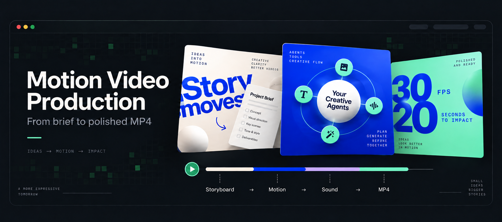
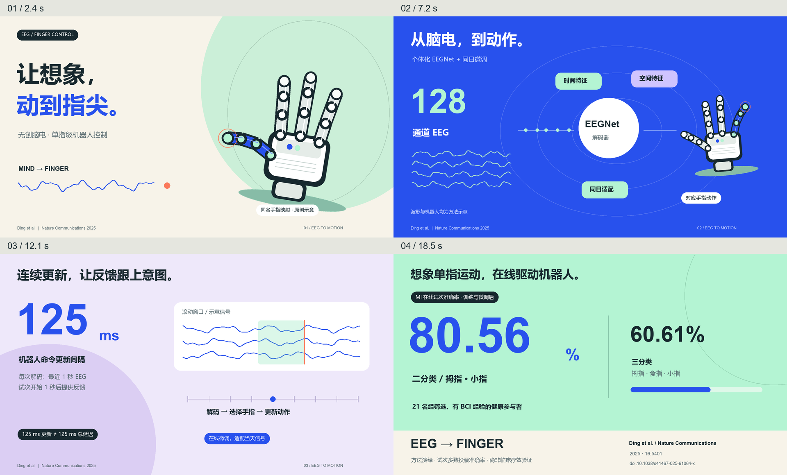

# Motion Video Production



让 Codex 把论文、产品界面、数据或创意制作成完整动效视频。默认先确认分镜与关键静帧，再制作动画和声音、检查编码后的 MP4。技术路线根据内容与运行环境选择。

## 公开展示案例

本仓库以 Ding 等发表于 **Nature Communications (2025)** 的 [EEG 单指实时机器人手控制研究](https://doi.org/10.1038/s41467-025-61064-x) 为示例。视频展示从脑电、解码到机器人手指动作的过程，采用明亮画面、变化构图、独立对象动画与合成音效。

[](assets/eeg-finger-control/reference.mp4)

**[查看 / 下载完整 MP4](assets/eeg-finger-control/reference.mp4)** · 20 秒 · 1920 × 1080 · 30 fps · H.264 / AAC

视频中的机器人、波形和信号包均为原创方法示意。80.56% / 60.61% 是二分类 / 三分类 MI 的在线试次准确率，来自 21 名经筛选、有 BCI 经验的健康参与者，训练与微调后的结果。125 ms 为命令更新间隔，每次使用最近 1 秒 EEG；反馈在试次开始 1 秒后启动。

见[论文证据与分镜](assets/eeg-finger-control/source-notes.md)，以及[示例设计说明](references/approved-recipe.md)。

## 安装到 Codex

把仓库放入 `$CODEX_HOME/skills/motion-video-production`；未设置 `CODEX_HOME` 时，默认位置为 `~/.codex/skills/motion-video-production`。

Windows PowerShell：

```powershell
$skillRoot = if ($env:CODEX_HOME) { Join-Path $env:CODEX_HOME 'skills' } else { Join-Path $env:USERPROFILE '.codex/skills' }
git clone https://github.com/Songjun113/motion-video-production.git (Join-Path $skillRoot 'motion-video-production')
```

如果已安装同名 Skill，请先备份并检查已有修改再更新。新建 Codex 会话后使用 `$motion-video-production` 调用。

## 使用

```text
使用 $motion-video-production，为附件论文制作 20 秒横屏动效视频。
采用明亮的产品宣传风格，突出问题、机制和主要结果。
先给我分镜及关键静帧，确认后交付带音效的完整 MP4。
```

希望连续完成时，加上：`直接出片，无需中途确认。`

Skill 会根据任务选择 Web / Canvas / SVG、Remotion、HyperFrames、Python、FFmpeg、Blender 或混合路线。实际可用的渲染器取决于环境；附带的 Python 案例仅需本地依赖。

## 工作流程

1. 提炼内容，核实数据与素材来源。
2. 设计视觉风格、分镜、关键静帧和对象转场。
3. 确认后制作分层动画、字幕和声音。
4. 输出 MP4，检查时长、分辨率、帧率、完整解码、画面及音频。

## 本地复现示例

需要 Python 3.10+ 与已安装的中文字体。在仓库根目录运行：

```text
python -m pip install -r requirements.txt
python assets/eeg-finger-control/render_video.py --preview --output ./preview-output
python assets/eeg-finger-control/render_video.py --output ./render-output
python scripts/verify_mp4.py ./render-output/eeg-finger-control-20s.mp4 --duration 20 --size 1920x1080 --fps 30 --require-audio --output ./qa
```

渲染不需要论文 PDF、API 密钥或实验数据。字体使用本机候选字体；可用 `MOTION_FONT_REGULAR`、`MOTION_FONT_BOLD`、`MOTION_FONT_LATIN`、`MOTION_FONT_LATIN_BOLD` 指定字体路径。字体替换后需复查换行与版式。

检查脚本会完整解码并输出元数据、抽帧、音频测量和波形。画面与听感需人工检查，脚本通过不代表创意或听感验收。

## 内容来源

- Yidan Ding, Chalisa Udompanyawit, Yisha Zhang & Bin He (2025). *EEG-based brain-computer interface enables real-time robotic hand control at individual finger level*. Nature Communications 16, 5401. DOI: [10.1038/s41467-025-61064-x](https://doi.org/10.1038/s41467-025-61064-x).
- 论文采用 [CC BY 4.0](https://creativecommons.org/licenses/by/4.0/)；视频为原创示意性解说动画，数据含义及人群范围见案例说明。
- 封面是 AI 生成的项目展示图，[提示词](docs/banner-prompt.md)已保留。

仓库未指定软件开源许可证；第三方论文许可不自动适用于仓库全部代码。
